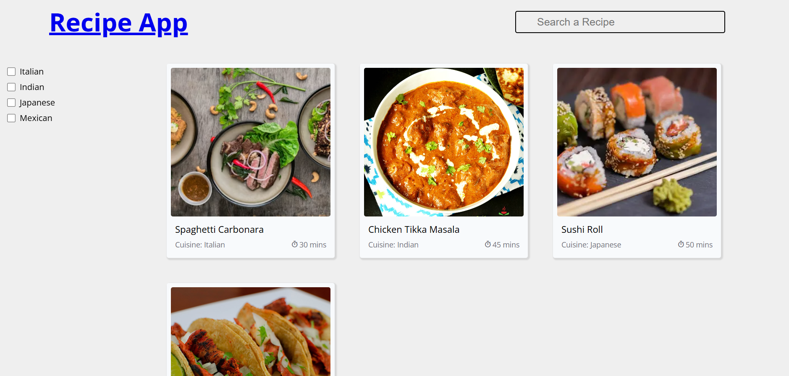
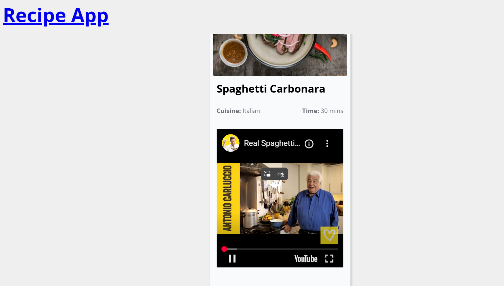

# 🍳 Recipe Web App

[](#)
[](#)
[](#)

Hello! Welcome to the repository for my Recipe App. 

I built this project because I wanted a clean, fast, and modern way to browse, search, and filter recipes without the clutter you often find on recipe websites. It is built entirely from scratch using vanilla JavaScript, HTML, and CSS. It was a great way to focus on core web development fundamentals—like DOM manipulation, responsive design, and state management—without relying on heavy frontend frameworks.

## What It Does

The goal here was to make finding a recipe as frictionless as possible:
* **Browse & Discover:** The homepage displays a curated list of recipes with high-quality images and quick details.
* **Instant Search:** You can type a dish's name into the search bar, and the list updates in real-time.
* **Cuisine Filters:** I added interactive checkboxes on the side so you can narrow down your choices (like Italian, Indian, or Mexican) instantly.
* **Deep Dive:** Clicking on any recipe takes you to a dedicated details page, complete with full instructions and an embedded video tutorial to help you cook along.

## A Quick Look

Here is how the application looks on desktop. (It is fully responsive, so it looks great on phones, too!)

| Home Page | Recipe Details |
| :---: | :---: |
|  |  |

## How to Run It Locally

Because this is built with pure HTML, CSS, and JS, there are no build tools, Node modules, or backend servers to configure. Getting it running is about as simple as it gets:

1. Download or clone this repository to your machine.
2. Open the `index.html` file directly in your favorite web browser. 

That's it! If you use VS Code, the "Live Server" extension works perfectly for this.

## How the Code is Organized

I tried to keep the architecture as straightforward and modular as possible:

```text
├── index.html           # The main entry point
├── single-recipe.html   # The layout for individual recipe details
├── index.js             # Handles the homepage search, filter, and navigation logic
├── single-recipe.js     # Manages fetching and displaying data for the details page
├── getCuisine.js        # A helper to render the cuisine filter checkboxes
├── getRecipeCard.js     # A helper that generates the HTML for the recipe cards
├── style.css            # All the main visual styling
├── utility.css          # Reusable classes for layout and spacing
└── reset.css            # A standard CSS reset for browser consistency
Customizing and Building Upon It
If you want to use this as a template or take it further, you absolutely can:

Add your own data: Right now, the app uses mock data arrays in index.js and single-recipe.js. You can easily swap these out with your own recipes.

Connect an API: I have included Axios via a CDN. If you want to pull live data from a real recipe database, you can replace the mock data logic with live Axios requests.

Make it your own: The CSS is split into standard styles and utility classes, making it pretty simple to change the color scheme, typography, and branding.

Credits & License
This project was built by Tejas Pardeshi.

A quick shoutout to Unsplash for the sample imagery, Google Fonts for the typography, and Axios for handling the HTTP requests.

Feel free to use, modify, and learn from this code—it is open-source and licensed under the MIT License.